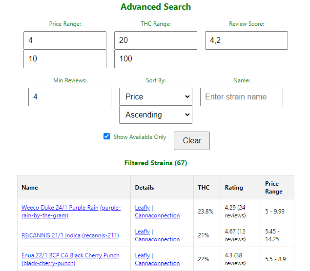
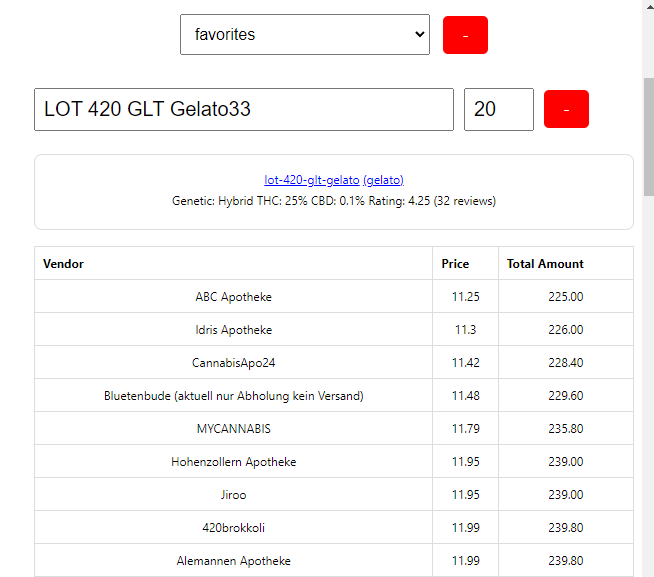

# flowzz-shopping-helper

Chrome/Edge Extension to easily compare strain prices on flowzz.com

Features:
* Sync strains from flowzz.com into local storage
* Use auto completion to select strains and to see the vendors offering them as well as their prices
* Get an overview which vendor is selling all selected strains and sort them by price
* Save, Edit and Delete Presets of strains for quick price comparison

Hint: This extension has been fully generated with the help of ChatGTP.

How to use?

1. Download latest version from [Releases](https://github.com/FrittenToni/flowzz-shopping-helper/releases).
2. Unzip extension
3. Open Chrome: chrome://extensions
3. Make sure that "Developer Mode" is active. Otherwise you can only install extensions from the official store.
4. Click "Load unpacked extension"
5. Choose folder containing plugin - The plugin is installed

Extension Usage:
* Select extension (puzzle) symbol in Chrome
* Pin the app "Flowzz Shopping Helper" for ez access
* Open https://flowzz.com. Make sure you are logged on. The extension uses your session to retrieve the data.
* Open the extension by clicking the weed icon
* Enjoy the price comparison ;-)

Hint: Vendors with price tags for certain products but not being able to ship a strain will be filtered out.