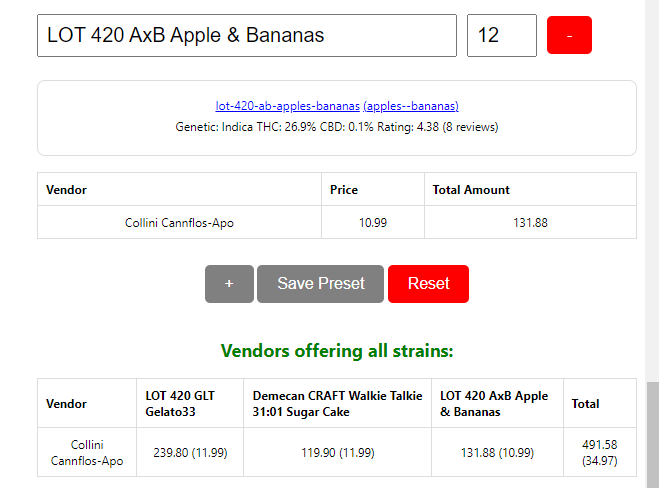

  

Elevate your cannabis shopping experience with the Flowzz Shopping Helper. This powerful browser extension for Chrome, Firefox and Edge seamlessly integrates with flowzz.com, allowing you to effortlessly compare strains and prices across multiple vendors. Whether you're a medical user or a connoisseur, this tool is designed to make your search for the perfect strain quick, easy, and tailored to your needs.

**Hint:** This extension has been fully generated with the help of ChatGTP.

**Key Features::**
* Automatically sync strains from flowzz.com to your local storage, ensuring your data is always up-to-date.
    
 
      
    

* Switch to Dark Mode for a visually comfortable browsing experience, especially during late-night sessions.
   

      
   

* **Advanced Search**
  * Refine your search with filters for Price, THC, CBD, Review Score + Count, Producer, and Genetics.
  * Sort your results by Price, Rating, THC, CBD, Name, or Published Date to find exactly what you’re looking for.
  * View reviews directly within the filter results, making it easier to choose the best option.
  

    
  

* **Price Finder**
  * Utilize auto-completion to quickly select strains and view vendor prices in real-time.
  * Easily compare which vendors offer the selected strains and sort them by price for the best deals.
  * Save, edit, and delete presets of strains to streamline your price comparisons for future use.
  * Benefit from a smart filtering system that removes vendors unable to ship certain products, ensuring you're only shown viable options.
  
  
    
  
  
  
  
    
  

Make informed decisions with the Flowzz Strain & Price Comparison Extension - your go-to tool for finding the best cannabis strains at the best prices, all in one place.
  
## Chrome/Edge Installation:
1. Download latest zip file from [Releases](https://github.com/FrittenToni/flowzz-shopping-helper/releases).
2. Unzip extension
3. Open Chrome: chrome://extensions, under Edge open extension management.
3. Make sure that "Developer Mode" is active. Otherwise you can only install extensions from the official store.
4. Click "Load unpacked extension"
5. Choose folder containing plugin - The plugin is installed
6. Select extension (puzzle) symbol in Chrome
7. Pin the app "Flowzz Shopping Helper" for ez access

## Firefox Installation:
Hint: To install this extension extension signing needs to be disabled. This seems to be possible only in the firefox versions (ESR, Developer Edition and Nightly). Open "about:config" and set "xpinstall.signatures.required" to false. I do not encourage anyone to do this. 
1. Download latest .xpi file from [Releases](https://github.com/FrittenToni/flowzz-shopping-helper/releases).
2. Open "Manage Extensions"
3. Install "Add-On from file"
4. Select .xpi

## Extension Usage:
* Open https://flowzz.com. Make sure you are logged on. The extension uses your session to retrieve the data.
* Open the extension by clicking the weed icon
* Enjoy cheap herb prices ;-)
