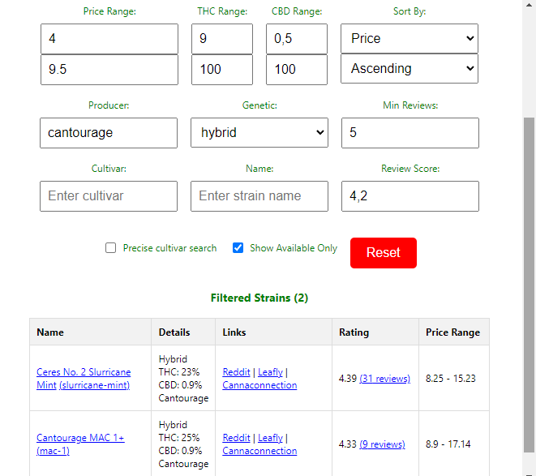

  

Browser Extension for Chrome/Edge/Firefox to easily compare strains and prices on flowzz.com.

**Hint:** This extension has been fully generated with the help of ChatGTP. Please reach out if you can support in bringing these extensions into the respective App stores.

**Features:**
* Sync strains from flowzz.com into local storage
* Auto-refresh if flowzz strain count differs local strain count
* **Advanced Search**
  * Price, THC, Score, Producer, Genetic Filters 
  * Sort by Price, Rating, THC, Name, Published Date
  * Show reviews directly in filter result table
* **Price Finder**
  * Use auto completion to select strains and to see the vendors offering them as well as their prices
  * Get an overview which vendor is selling all selected strains and sort them by price
  * Save, edit and delete presets of strains for quick price comparison
  * Hint: Vendors with price tags for certain products but not being able to ship will be filtered out.

## Chrome/Edge Installation:
1. Download latest zip file from [Releases](https://github.com/FrittenToni/flowzz-shopping-helper/releases).
2. Unzip extension
3. Open Chrome: chrome://extensions, under Edge open extension management.
3. Make sure that "Developer Mode" is active. Otherwise you can only install extensions from the official store.
4. Click "Load unpacked extension"
5. Choose folder containing plugin - The plugin is installed
6. Select extension (puzzle) symbol in Chrome
7. Pin the app "Flowzz Shopping Helper" for ez access

## Firefox Installation:
Hint: To install this extension extension signing needs to be disabled. This seems to be possible only in the firefox versions (ESR, Developer Edition and Nightly). Open "about:config" and set "xpinstall.signatures.required" to false. I do not encourage anyone to do this. 
1. Download latest .xpi file from [Releases](https://github.com/FrittenToni/flowzz-shopping-helper/releases).
2. Open "Manage Extensions"
3. Install "Add-On from file"
4. Select .xpi

## Extension Usage:
* Open https://flowzz.com. Make sure you are logged on. The extension uses your session to retrieve the data.
* Open the extension by clicking the weed icon
* Enjoy cheap herb prices ;-)
